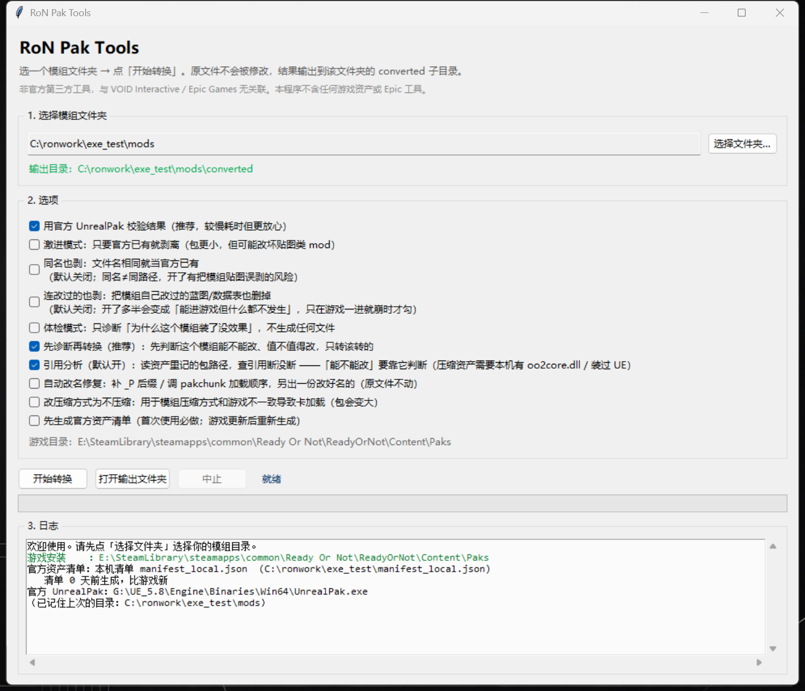
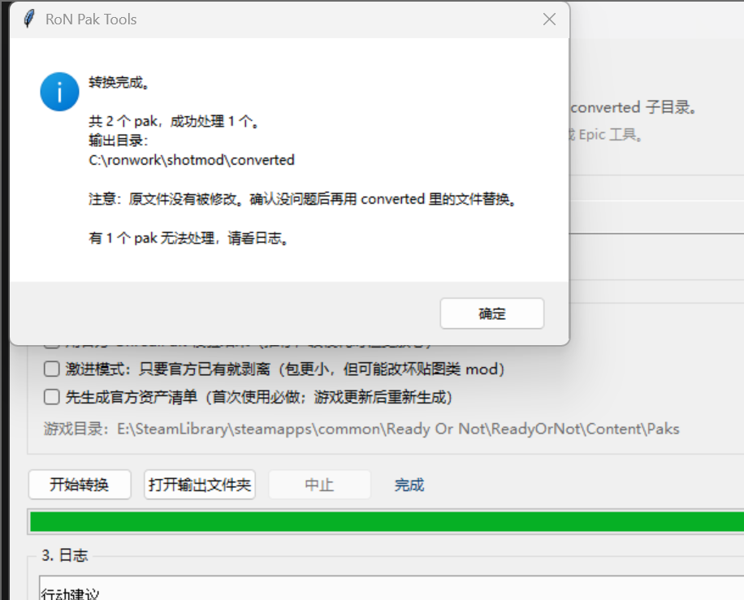

# ron-pak-tools

[](https://github.com/lzkorion/ron-pak-tools/actions/workflows/tests.yml)

**Ready or Not 模组 `.pak` 诊断与转换工具**
Detect and repair Ready or Not mods that broke after a game update.

[中文](#中文) · [English](#english) · **[下载 exe](https://github.com/lzkorion/ron-pak-tools/releases/latest)** · [NOTICE.md](NOTICE.md) · [LICENSE](LICENSE) (MIT)

> ⚠️ **非官方第三方工具**，与 VOID Interactive / Epic Games **无任何关联**，未获其授权或背书。
> 本项目**不含**任何游戏资产、游戏数据清单或 Epic 工具。
> "Ready or Not" 为 VOID Interactive 商标；"Unreal" 为 Epic Games 商标。



---

## 中文

### 这是什么

Ready or Not 每次大更新，都会**把一部分热门模组的内容直接做进游戏本体**。
但玩家的模组还留着，覆盖着同一批资产路径：

```
模组：/Game/Blueprints/Items/WeaponsRevised/Primary_G3A3   ← 旧编译产物
官方：/Game/Blueprints/Items/WeaponsRevised/Primary_G3A3   ← 新编译产物
```

挂载冲突 → **崩溃 / 卡在加载**。

**这不是版本问题，升级 pak 版本救不了。** 真正要做的是
**把官方已经内置的那部分剥掉**，只留模组独有的内容。

这个工具就是干这个的：扫一遍你的模组文件夹，判断哪些内容官方已经有了，
把会冲突的部分剥掉重新打包。

### 功能

| 功能 | 说明 |
|---|---|
| **批量转换** | 整个文件夹丢进去，自动逐个检测并转换 |
| **智能判定** | 只剥「蓝图/逻辑/数据」这类会冲突的；贴图/模型/音频等**资源替换一律保留** |
| **先诊断再转换** | 先给结论（可以转换 / 不用转换 / 不建议转换 / 转换也修不好），只转该转的 |
| **自动改名修复** | 补 `_P` 后缀、调 pakchunk 加载顺序，出一份改好名的副本（原文件不动） |
| **引用分析** | 读资产内部记的包路径，查出「引用的资产游戏更新后没了」并给出现在的名字 |
| **可改性判定** | 直接回答「这个模组能不能改、值不值得改」，能用的模组不劝人动 |
| **重新打包** | 自己实现 pak v11/v12 写入器，压缩数据原样搬运，保留条目**逐字节不变** |
| **官方校验** | 可选调用本机 UnrealPak 做 `-List` / `-Test` 复核 |
| **图形界面** | 双击 exe 就能用，不需要命令行 |

### 下载即用（不需要装 Python）

**[⬇ 下载 RoNPakTools.exe](https://github.com/lzkorion/ron-pak-tools/releases/latest)**
（约 11 MB，Windows 10/11 64 位，免安装）

下载后核对一下校验和更稳妥：

```powershell
Get-FileHash .\RoNPakTools.exe -Algorithm SHA256
```

首次运行会让你先生成「官方资产清单」——用你自己安装的游戏在本机生成，
只写在你电脑上，**不包含也不上传任何游戏数据**。

### 快速开始

#### 方式一：图形界面（推荐）

1. 双击 `RoNPakTools.exe`
2. 首次使用点「**先生成官方资产清单**」（用你自己装的游戏，在本机生成，几秒即可）
3. 选模组文件夹 → 点「开始转换」
4. 结果在 `<模组文件夹>\converted\`，**原文件不会被修改**

#### 方式二：命令行

```powershell
# 从游戏本体 paks 生成全路径清单（几秒），再做转换
python tools/ronconvert.py "C:\你的模组文件夹" `
    --game-paks "E:\SteamLibrary\steamapps\common\Ready Or Not\ReadyOrNot\Content\Paks"

# 一键批量转换（已有清单时）
python tools/ronconvert.py "C:\你的模组文件夹" --verify

# 先看诊断，不写文件
python tools/ronconvert.py "C:\你的模组文件夹" --dry-run

# 只回答「这是什么类型的 mod、能不能改、要不要改名」（不写文件）
python tools/ronhealth.py "C:\你的模组文件夹" --assess

# 顺手把该改名的模组复制一份改好名的出来（原文件不动）
python tools/ronhealth.py "C:\你的模组文件夹" --fix-names "C:\fix"

# 引用分析：它引用的资产游戏里还在不在（只读）
python tools/ronhealth.py "C:\你的模组文件夹" --refs
```

> 清单必须是**全路径**（`readyornot/content/blueprints/...`）。
> 如果手上的是只有文件名的旧清单，工具会提示你重新生成 ——
> 因为按文件名剥会把模组自己的贴图剥掉。

### 转换后的四种结论

| 结论 | 含义 | 你该做什么 |
|---|---|---|
| **已转换（剥离冲突）** | 剥掉了会冲突的蓝图/数据资产 | 用 `converted` 里的文件替换原模组 |
| **本来就可用** | 没有可剥的冲突资产 | 不用动 |
| **已被官方完全取代** | 剥离后一条不剩 | **删除该模组**（不会产出空 pak） |
| **无法处理** | 不是合法 pak | 人工检查 |

转换完成后会弹窗告知输出目录，日志里给出每个模组的结论和行动建议：



### ★ 为什么不是「官方已有就全剥」

「官方已有」有两种完全不同的含义：

| 情况 | 例子 | 处理 |
|---|---|---|
| 蓝图/逻辑/数据被官方新版取代 | 武器改进包 | **会冲突崩溃 → 剥掉** |
| 贴图/模型/音频等资源替换 | 血腥贴图 | **正常 mod → 必须保留** |

所以默认走**保守白名单**：只剥「扩展名是 `.uasset`/`.umap` 且路径像
蓝图/逻辑/数据表/角色/武器/UI」的官方条目。
需要激进模式时用 `--strip-all`（**可能把贴图类 mod 改坏，慎用**）。

### ★★ 「同名」不等于「同路径」（v1.0.1 修的关键 bug）

光有白名单还不够，**判定「官方已有」必须要求路径完全一致**。

真实模组的路径长这样：

```
mount = '../../../ReadyOrNot/Content/'
rel   = 'ReadyOrNot/Character/Gore/Gore_Cuts/T_Gore_Limb_Amputations_body_BC.uasset'
```

注意 `rel` 里**又写了一遍 `ReadyOrNot/`**（挂载点里已经有了），所以它和官方
永远「同路径匹配不上」，但**文件名**和官方某个资产一样。

v1.0.0 用文件名判定「官方已有」→ 把模组自己的贴图/网格当成官方内容剥掉 →
**模组直接失效**。实测（用户提供的原版/转换后成对数据）：

| 模组 | 条目 | 旧逻辑剥掉 | 其中误杀 | 新逻辑剥掉 |
|---|---|---|---|---|
| Restoration | 39 | 33 | **25** 个骨骼网格/贴图 | 8（全是蓝图） |
| VisceralBlud | 1125 | 155 | **151** 个贴图/贴花/MI | 4 |
| VisceralGore | 523 | 31 | **31** 个网格/贴图/MI | 0（本来就可用） |
| wound | 9 | **9（全剥光）** | 9 | 0（本来就可用） |

`wound` 被剥到 0 条，pak 只剩 396 字节 —— 装上去完全没效果。

从 v1.0.1 起：

* 匹配强度分三级：`full`（路径完全一致，**可信**）/ `bare`（只有文件名相同，**存疑**）/ `none`
* **默认只信 `full`**；`bare` 一律不剥
* 模组路径里重复的 `ReadyOrNot/`、`Content/` 前缀会自动去掉再比对，让 `full` 能命中
* 需要按文件名剥时，显式开 `--match-name`（GUI 里的「同名也剥」），
  且同名出现在多个目录时仍然拒绝剥
* 清单里如果只有裸文件名，工具会**明确报错**让你重新生成，而不是静默空转

> 这条原则在代码注释、测试（`tests/test_safety.py`）和本文档里都有，
> 有测试保护，别再改回去。

### ★★ 路径一致 ≠ 内容一致（v1.1.0 起：改过的一律保留）

就算路径完全一致，也只能说明「指向同一个资产」，**不代表内容一样**。
而这两件事的处理方式**完全相反**：

| 情况 | 例子 | 处理 |
|---|---|---|
| 模组只是**照抄**了官方资产（作者打包时顺手带上的依赖） | 旧蓝图副本 | **剥掉**：零损失，还能解决崩溃 |
| 模组**改过**这个资产（那就是模组的功能本身） | 血腥 mod 改 `Blood_Standard` 数据表、改 `BP_RoNBloodPool` 让它生成自己的贴花 | **必须保留**：剥掉 = 游戏能进但**什么都不发生** |

**怎么区分？** 比对官方条目的两个大小：

```
未压缩大小 == 模组 且 压缩后大小 == 模组   -> 照抄官方，剥掉零风险
任一不同                                  -> 内容不一样，当作「模组改过」，不剥
```

> **为什么必须两个都比**（这点很反直觉，但官方指南讲得很清楚）：
> RoN 模组是用 [UAssetGUI](https://unofficial-modding-guide.com/posts/uassetmodding/)
> **直接改游戏烤好的资产**做出来的 —— 改个数字、换个引用，**文件大小根本不会变**。
> 所以「未压缩大小一样」是这个游戏里**正常模组的常态**，完全不能当作「照抄官方」的证据。
>
> 实测 `VisceralBlud` 的 `BP_RoNBloodPool`：未压缩两边都是 6,057 B，
> 但压缩后 **2,260 vs 2,198** —— Oodle 对相同输入是确定性的，压缩后不一样
> 就说明内容真的被改过。只看未压缩大小会把它误判成「照抄」，
> 剥掉之后整个血腥效果就没了（这就是「能进游戏但什么都不发生」）。

v1.1.0 起默认**只剥能证明是照抄官方的**，其余一律保留。要连改过的一起剥
（比如游戏一进就崩、必须清掉旧蓝图），加 `--strip-modified`
（界面勾「**连改过的也剥**」）—— 但开了之后模组很可能变成
「能进游戏但什么都不发生」，这**正是**之前用户反馈的那个症状。

清单里没有 `sizes`/`csizes` 段时判断不了，程序会**保守地一个都不剥**并提示重新生成
（生成只要几秒）。

实测四个真实模组（v1.1.0 默认）：

| 模组 | 条目 | 之前会剥 | v1.1.0 默认 | 原因 |
|---|---|---|---|---|
| Restoration | 39 | 8 | **0** | 4 个蓝图内容被模组改过 |
| VisceralBlud | 1125 | 4 | **0** | `Blood_Standard` + `BP_RoNBloodPool` 都被改过 |
| VisceralGore | 523 | 0 | **0** | 本来就无可剥 |
| wound | 9 | 0 | **0** | 本来就无可剥 |

也就是说这四个模组**原样输出**（逐字节等于原文件）。

### 体检模式：为什么这个模组装了没效果？（v1.2.0）

转换之外还有一个**只诊断、不写文件**的模式（界面勾「体检模式」，或命令行
`python tools/ronhealth.py "某模组.pak"`）。它按官方指南
[The Basics → Debugging](https://unofficial-modding-guide.com/posts/thebasics/)
的清单逐条查：

| 检查项 | 报什么 |
|---|---|
| 文件名 | 必须 `_P.pak` 结尾 —— 指南点名：「No `_P` at the end of the mod name」 |
| 挂载点 | 必须是「包住全部内容的最深目录」，**而且真实存在于游戏里** |
| 路径 | 多少条能对上官方（覆盖），多少条是游戏里没有的新路径 |
| 加载顺序 | 同一路径被别的模组用**更大的 pakchunk 号**覆盖了 → 你输；同号 → 谁生效不确定 |
| 资产成组 | `.uasset`/`.uexp`/`.ubulk` 缺一不可，孤儿条目会让引擎读不了 |
| 包格式 | 抽样看 `.uasset` 头部魔数对不对 |
| 官方工具 | 可选跑 UnrealPak `-List` / `-Test` |

输出长这样：

```
── pakchunk9999-ArteryHits_P.pak
   ✔ 文件名以 `_P.pak` 结尾
   ✔ 挂载点在游戏里存在（76 条官方路径在它下面）
   ✔ 覆盖官方资产 2 条   例：AmmoDataTable.uasset、AmmoDataTable.uexp
   ✔ 资产成组完整（1 个资产，无孤儿/缺件）
   ── 结论：没发现结构性问题
```

### 自动改名修复：文件名不对，转换再多次也没用（v1.6.0）

「装了没效果」的模组里，很大一部分根本不是内容问题，而是**文件名问题**。
勾上界面里的「**自动改名修复**」（或命令行 `--fix-names <输出目录>`），
工具会算出这个 pak 该叫什么，并**复制**一份改好名的给你 —— **原文件绝不动**。

三条确定性规则（只改有把握的，其余一律不碰）：

| 情况 | 改成 | 依据 |
|---|---|---|
| 文件名不是 `_P.pak` 结尾 | 补上 `_P` | 官方指南点名的头号错误：主线 pak 存在时，补丁 pak 没有 `_P` 很可能根本不加载 |
| 解析不出 `pakchunk<N>-` 前缀 | 补 `pakchunk9999-` | 没有这个前缀就没有加载顺序可言 |
| 同一路径被 **pakchunk 号更大**的模组压着 | 把号提到 `最大号 + 1` | 同一个路径，数字大的赢 —— 现在你赢 |

```
MyMod.pak  ->  pakchunk10000-MyMod_P.pak
  · 文件名不是 _P.pak 结尾 —— 很可能根本不加载（可以用「自动改名修复」补上）
  · 被 pakchunk9999-Mods_wound_P.pak 覆盖（它 pakchunk9999 > 你的 pakchunk0）
```

两条底线：**读不动的 pak 不会生成改名副本**（免得看起来像被修好了）；
目标名已存在时**不覆盖**，改成 `名字(1).pak` 另存。

### 模组类型识别：这个 mod 到底在改什么？（v1.6.0）

诊断会先告诉你它属于哪几类（可以多标签），并说明**转换对它有没有用**：

| 类型 | 说明 |
|---|---|
| 地图 | 自定义地图必须作者重新烤，重打包改变不了任何东西 |
| 贴图替换 | 覆盖官方贴图是正常 mod 行为，没有可剥的东西 |
| 材质替换 | 覆盖官方材质是正常 mod 行为，没有可剥的东西 |
| 网格替换 | 覆盖官方网格是正常 mod 行为，没有可剥的东西 |
| 蓝图/逻辑 | 最容易因为游戏更新而崩溃 —— 但也最可能是模组的功能本身 |
| 数据表 | 模组改数值的主要手段，剥了就等于删功能 |
| 音频替换 / 动画 | 覆盖官方资源是正常 mod 行为 |
| 纯新增内容 | 全是游戏里没有的新路径，没有可剥的东西 |

```
── pakchunk9999-Mods_wound_P.pak
   类型：贴图替换
        · 贴图替换：覆盖官方贴图是正常 mod 行为，没有可剥的东西
   ── 诊断结论：【不用转换】没有可剥的内容，原样用就行
```

命令行：

```powershell
# 只诊断：这个 mod 是什么类型、能不能改、要不要改名
python tools/ronhealth.py "C:\你的模组文件夹" --assess

# 诊断 + 把该改名的复制到 fix 目录（原文件不动）
python tools/ronhealth.py "C:\你的模组文件夹" --fix-names "C:\你的模组文件夹\fixed"
```

### 「能不能改」：软件直接给结论（v1.8.0）

每次诊断的最后一行是一句明确的可改性结论 —— 本工具能不能改它、值不值得改：

| 结论 | 意思 | 你该做什么 |
|---|---|---|
| **可以改** | 有明确、安全、值得做的事 | 看下面「能做什么」逐条列的（剥几条 / 改名 / 改压缩方式） |
| **不用改** | 没有可改的地方 | 原样用 |
| **别改** | 动手会毁掉它的功能（官方同路径的资产全是它自己改过的） | 别动，现在能用就行 |
| **改不了** | 问题在本工具能力之外 | 等模组作者更新，或换一个模组 |

三条刻意定死的规矩：

- **能用的模组不劝人动。**「不用改 / 改不了 / 别改」后面都会附一句
  「既然现在能用，就别动它 —— 不做事永远是安全的选项」。
- **有硬伤就不说「可以改」。**Hospital 地图模组：压缩方式确实不一致、也确实能改，
  但**改完照样闪退**（这个实验我们做过）—— 所以它判「改不了」，
  只如实附上「能做什么：改压缩方式（做了也救不了它）」。
- **「改不了」要说清楚卡在哪**：地图要重烤 / 引用断了 / pak 读不动，一条条列出来。

实测 8 个装机模组：**7 个「改不了」+ 1 个「别改」（AK74M），没有一个「可以改」**。
换句话说：你现在这套模组，本工具帮不上忙，原样用就是最优解。

### 引用分析：它引用的资产，游戏里还在不在？（v1.7.0）

「装了没效果 / 一闪退」的另一个大头是**引用断了**。RoN 模组是拿 UAssetGUI 直接改
「游戏烤好的资产」做的，所以模组资产**内部记着它引用的包路径**；游戏一更新，
官方经常把资产改名、搬目录、拆成好几份，模组还在引用老路径 —— 轻则那个资产
加载不出来，重则加载时直接崩。**这个转换修不了**，以前也完全看不出来。

勾界面上的「**引用分析**」（命令行 `--refs`），程序会读出每个资产的引用和官方清单对账：

| 结果 | 含义 | 例子（实测） |
|---|---|---|
| **有近似的名字** | 多半是这次更新改名/搬了目录，并给出**现在最可能叫什么** | `LACRIMAL_INST_V2` → `.../instance/lacrimal_inst_v2`；`Curve_Damage_Shotgun` → `curve_damage_shotgun_590`；`icn_12g_bucknew` → `icn_12g_bucknew_1024` |
| **彻底没有这个包名** | 作者没打包进来，或者官方把它删了 | `T_Blood_Splash`、`M_Drip`（作者改名后没更新引用） |
| **位置对不上** | 资产内部记的包路径和它在 pak 里的位置不一致 —— 引擎按包名找文件，对不上就永远加载不到它 | `wound` 的三个贴图 |

输出长这样（真实数据，ArteryHits 弹药模组）：

```
── 引用分析：pakchunk9999-ArteryHits_P.pak
   资产 1 个，读出 1 个
   引用 53 个：游戏里还在 50 个，模组自己的 0 个，【已断 3 个路径】

   ✘ 游戏里还有近似的名字（多半是这次更新改名/搬了目录）：3 个路径
      /Game/Blueprints/Items/DamageCurves/Curve_Damage_Shotgun
         游戏里最接近的是 .../blueprints/items/damagecurves/curve_damage_shotgun_590.uasset
         引用它的资产：AmmoDataTable.uasset
      /Game/IconTextures/Loadout/icn_12g_bucknew
         游戏里最接近的是 .../icontextures/loadout/icn_12g_bucknew_1024.uasset
         引用它的资产：AmmoDataTable.uasset
```

**Oodle 压缩的资产**需要一个 Oodle 解码器：程序**只找你本机已经有的
`oo2core*.dll`**（游戏目录 / UE 安装目录 / System32），**不分发、不下载**。
找不到时明确降级：只分析未压缩的资产，并说明原因 —— 不会给你一个假的「没问题」。

实测 8 个真实装机模组，**一共约 9 秒**（最慢的单个 2.8 秒，1.1 GB 的地图模组）。

### 清单生成：现在只要几秒

v1.0.0 生成清单要把每个本体 pak 整份读进内存（`pakchunk0` 有 24 GB），
既慢又可能爆内存 —— 实测常常直接跳过 `pakchunk0`，导致清单缺了 39 万条路径。

v1.0.1 只读 **pak 尾部 4 KB + 索引区**（`pakfmt.read_pak_index`），
25 个本体 pak、约 44 GB，**3 秒**扫完，47 万条全路径。

### 安装

需要 **Python 3.10+**（用到 `X | None` 类型语法）。无需第三方库，只用标准库。

```powershell
git clone https://github.com/lzkorion/ron-pak-tools.git
cd ron-pak-tools
python tools/ronconvert.py "C:\你的模组文件夹" --dry-run
```

**可选**：装了 Unreal Engine 才有 `UnrealPak.exe`，用于结果校验。
没有也能正常转换，只是跳过校验。

### 自己打包 exe

```powershell
pip install pyinstaller
python build_gui.py
# 产物：dist/RoNPakTools.exe
```

`build_gui.py` 会在打包前检查，确保不会把游戏数据或 Epic 工具打进发行物。

### 测试

```powershell
python tests/run_all.py
```

全部用**合成 pak**（`tests/fixtures.py` 现场生成），不需要游戏或真实模组。

推送后 GitHub Actions 会自动跑这些测试（Ubuntu + Windows，Python 3.10 / 3.11 / 3.13），另外还会检查仓库里没有混入游戏数据或 Epic 工具。

### 工作原理（为什么不会损坏内容）

1. 用自研解析器读出模组的**完整路径表**（pak 里本来就有，不需要猜）
2. 和**你本机生成的**官方清单比对 —— 只认**路径完全一致**，同名不算
3. 只丢弃判定为冲突的条目，并且**按资产整组处理**
   （一个资产 = `.uasset` + `.uexp` + `.ubulk` + `.bak` 变体，漏一个就成孤儿）
4. **压缩字节原样搬运**（不需要 Oodle 压缩器），重建索引

⇒ 保留的条目与原包**逐字节相同**，不是重新压缩。

已用四个真实模组端到端复核（官方 `UnrealPak -List` / `-Test` 全部 rc=0，
孤儿 0、缺件 0、新增 0、挂载点不变）。

### 项目结构

```
ron-pak-tools/
├── ronconvert_gui.py     图形界面
├── build_gui.py          打包脚本（含合规检查）
├── tools/
│   ├── pakfmt.py         ★ pak v11/v12 读写库（核心）
│   ├── ronconvert.py     ★ 检测 + 转换逻辑
│   ├── ronhealth.py      ★ 体检 / 诊断 / 模组类型 / 自动改名修复
│   ├── ronrefs.py        ★ 引用分析（读资产里的包路径，对账官方清单）
│   ├── ronverify.py      对比原版/转换后（孤儿 / 缺件 / 挂载点）
│   ├── ronstrip.py       精确剥离（--keep / --drop）
│   ├── roncheck.py       批量体检
│   ├── ronunreal.py      官方 UnrealPak 封装
│   └── ...               其它诊断工具
├── tests/                测试（全用合成数据）
└── docs/                 格式说明
```

### 许可

[MIT](LICENSE)。使用前请读 [NOTICE.md](NOTICE.md)（合规边界与风险提示）。

---

## English

### What this is


Every major **Ready or Not** update absorbs popular mods into the base game,
while players' mod `.pak` files keep overriding the same asset paths.
That mount conflict causes **crashes or infinite loading**.

**It is not a version problem** — bumping the pak version does not help.
The fix is to **strip the parts the game already ships** and keep only what is unique.

This tool scans your mod folder, decides which content the game already provides,
and repacks the mod without the conflicting parts.

### Features

| Feature | Description |
|---|---|
| **Batch convert** | Point it at a folder; every `.pak` is diagnosed and converted |
| **Conservative stripping** | Only strips blueprint/logic/data assets that conflict. Texture/model/audio replacements are **always kept** |
| **Diagnose before converting** | Verdict first (convert / no need / not advisable / unfixable), then it only converts what is worth converting |
| **Rename repair** | Appends `_P`, fixes the pakchunk load order, writes a correctly named copy (originals untouched) |
| **Reference analysis** | Reads the package paths recorded inside assets and finds references the game update broke, suggesting the current name |
| **Modifiability verdict** | Says plainly whether the tool can improve a mod, and refuses to recommend touching one that already works |
| **Path-exact matching** | "Same file name" is **not** "same asset". Only a full path match counts (see below) |
| **Repacking** | Own pak v11/v12 writer. Compressed bytes are copied verbatim, so kept entries stay **byte-identical** |
| **Verification** | Optionally calls your local UnrealPak for `-List` / `-Test` |
| **GUI** | Double-click the exe — no command line needed |

### Download

**[⬇ Download RoNPakTools.exe](https://github.com/lzkorion/ron-pak-tools/releases/latest)**
(~11 MB, Windows 10/11 x64, portable, no Python required)

On first run it generates an "official asset manifest" from *your own* game
installation. It stays on your machine and is never uploaded.

### ★★ "Same name" is not "same path" (the bug fixed in v1.0.1)

Requiring a full path match is what makes stripping safe. Real mods look like this:

```
mount = '../../../ReadyOrNot/Content/'
rel   = 'ReadyOrNot/Character/Gore/Gore_Cuts/T_Gore_Limb_Amputations_body_BC.uasset'
```

`rel` repeats `ReadyOrNot/` even though the mount point already contains it, so it
can never match an official path — yet its **file name** matches an official asset.

v1.0.0 matched on file name, so it stripped the mod's *own* textures and meshes and
**the mod stopped working**. Measured on real mods (original vs. converted pairs):

| Mod | Entries | Stripped by v1.0.0 | of which wrong | Stripped by v1.0.1 |
|---|---|---|---|---|
| Restoration | 39 | 33 | **25** skeletal meshes/textures | 8 (all blueprints) |
| VisceralBlud | 1125 | 155 | **151** textures/decals/MIs | 4 |
| VisceralGore | 523 | 31 | **31** meshes/textures/MIs | 0 (already fine) |
| wound | 9 | **9 (all of it)** | 9 | 0 (already fine) |

`wound` was stripped down to 0 entries — a 396-byte pak that does nothing.

Since v1.0.1:

* Match strength is graded `full` (identical path, **trusted**) / `bare` (name only, **suspect**) / `none`
* **Only `full` is trusted by default**; `bare` is never stripped
* Duplicated `ReadyOrNot/` and `Content/` prefixes are stripped before comparing,
  so `full` can actually hit
* Name-based stripping requires `--match-name` (GUI: "同名也剥"), and refuses
  names that occur in more than one directory
* A manifest containing only bare file names now produces an explicit error
  instead of silently doing nothing

### ★ Same path ≠ same content (since v1.1.0: edited assets are always kept)

An identical path only proves the mod points at the *same asset* — not that the
content is the same, and the two cases need **opposite** handling:

| Case | Example | Handling |
|---|---|---|
| Mod merely **copies** an official asset (a dependency the author packed by accident) | stale blueprint copy | **Strip it** — zero loss, and it fixes the crash |
| Mod **edited** that asset (that edit *is* the feature) | a gore mod editing `Blood_Standard`, or `BP_RoNBloodPool` to spawn its own decals | **Must keep it** — stripping gives you "loads fine, does nothing" |

**How they are told apart** — both sizes are compared:

```
uncompressed size matches AND compressed size matches  -> verbatim copy, safe to strip
either one differs                                     -> treat as "mod edited it", keep
```

> Why both: `VisceralBlud`'s `BP_RoNBloodPool` has an **identical uncompressed size**
> (6,057 B) but a **different compressed size** (2,260 vs 2,198). Oodle is
> deterministic for identical input, so a different compressed size means the
> content really differs. Comparing only uncompressed size would misclassify it
> as a copy — and stripping it kills the whole blood effect.

Since v1.1.0 only provable verbatim copies are stripped. To also strip edited
assets (needed when the game crashes on load), pass `--strip-modified`
(GUI: "连改过的也剥") — be aware that this is what produces the
"game loads but nothing happens" reports.

When the manifest has no `sizes`/`csizes`, nothing can be proven, so the tool
**conservatively strips nothing** and asks you to regenerate the manifest (seconds).

Measured on four real mods (v1.1.0 defaults):

| Mod | Entries | Previously stripped | v1.1.0 default | Why |
|---|---|---|---|---|
| Restoration | 39 | 8 | **0** | 4 blueprints were edited by the mod |
| VisceralBlud | 1125 | 4 | **0** | both `Blood_Standard` and `BP_RoNBloodPool` were edited |
| VisceralGore | 523 | 0 | **0** | nothing to strip |
| wound | 9 | 0 | **0** | nothing to strip |

All four are now emitted **byte-identical to the source pak**.

### Rename repair: a wrong file name beats any amount of converting (v1.6.0)

A large share of "installed it, nothing happens" mods are not a content problem
at all — they are a **file name** problem. Tick "**自动改名修复**"
(CLI: `--fix-names <outdir>`) and the tool works out what the pak should be
called and writes a **copy** under that name. **Your original file is never touched.**

Three deterministic rules — anything else is left alone:

| Situation | Becomes | Why |
|---|---|---|
| Name does not end in `_P.pak` | `_P` is appended | The #1 mistake the [official guide](https://unofficial-modding-guide.com/posts/thebasics/) calls out: with a main-game pak present, a patch pak without `_P` often does not load at all |
| No `pakchunk<N>-` prefix can be parsed | `pakchunk9999-` is prepended | Without it there is no load order to speak of |
| The same paths are overridden by a mod with a **higher pakchunk number** | the number is raised to `max + 1` | For identical paths the higher number wins — now you win |

```
MyMod.pak  ->  pakchunk10000-MyMod_P.pak
  · file name does not end in _P.pak - it most likely never loads
  · overridden by pakchunk9999-Mods_wound_P.pak (9999 > your 0)
```

Two hard limits: an **unreadable pak never gets a renamed copy** (so it cannot
look like it was fixed), and an existing target name is **never overwritten** —
the copy becomes `name(1).pak` instead.

### Mod type detection: what is this mod actually changing? (v1.6.0)

The diagnosis first tells you which categories it falls into (multiple allowed)
and whether converting it can help at all:

| Type | Note |
|---|---|
| Map | A custom map must be re-cooked by its author; repacking changes nothing |
| Texture replacement | Overriding official textures is normal mod behaviour; nothing to strip |
| Material / Mesh replacement | Overriding official assets is normal; nothing to strip |
| Blueprint / logic | Most likely to break after a game update — but also most likely to *be* the feature |
| Data table | The usual way mods change values; stripping it deletes the feature |
| Audio / animation replacement | Overriding official assets is normal |
| Purely additive content | All new paths the game never had; nothing to strip |

### "Can it be modified?" - the tool answers it (v1.8.0)

Every diagnosis now ends with an explicit modifiability verdict: can this tool
change it, is it worth changing, and would changing it make things worse?

| Verdict | Meaning |
|---|---|
| **Can be modified** | There is something concrete, safe and worthwhile to do (listed action by action) |
| **No change needed** | Nothing to change - use it as is |
| **Don't touch it** | Modifying would destroy it (every same-path official asset is the mod's own edit) |
| **Cannot be fixed** | The problem is outside this tool's reach (a map must be re-cooked, broken references need the author, the pak is unreadable...) |

Three rules are deliberately hard-coded:

- **A working mod is never nagged into being changed.** Every "no change needed /
  cannot be fixed / don't touch it" verdict adds: if it works today, leave it alone -
  doing nothing is always the safe option.
- **A hard defect never yields "can be modified".** The Hospital map mod: its
  compression really does mismatch, and it really can be re-packed - but it **still
  crashes afterwards** (we ran that experiment). It is therefore reported as
  "cannot be fixed", with an honest note of what *could* be done and that it would
  not help.
- **"Cannot be fixed" always says what is blocking it** - re-cook needed, broken
  references, unreadable pak.

Measured on 8 installed mods: **7 "cannot be fixed" + 1 "don't touch it" (AK74M),
none "can be modified"**. In other words: for this set, leaving everything alone is
optimal. `--assess` now runs the reference analysis by default (the verdict needs
it); `--no-refs` disables it.

### Reference analysis: are the assets it references still in the game? (v1.7.0)

The other big cause of "installed it, nothing happens / instant crash" is a **broken
reference**. RoN mods are made by editing the game's *cooked* assets with UAssetGUI,
so every mod asset **carries the package paths it references**. When the game
updates, official assets are frequently renamed, moved or split — and the mod keeps
referencing the old path. Worst case the reference is null and loading crashes.
**Converting cannot fix this**, and until now nothing could even show it.

Tick "**引用分析**" in the GUI (CLI: `--refs`) and the tool reads every asset's
references and checks them against the official manifest:

| Result | Meaning | Real example |
|---|---|---|
| **A similar name still exists** | Almost certainly renamed/moved by the update — the tool names the likely current asset | `LACRIMAL_INST_V2` → `.../instance/lacrimal_inst_v2`; `Curve_Damage_Shotgun` → `curve_damage_shotgun_590`; `icn_12g_bucknew` → `icn_12g_bucknew_1024` |
| **The package name is gone entirely** | The author never packed it, or the game removed it | `T_Blood_Splash`, `M_Drip` |
| **Location mismatch** | The asset's own recorded package path disagrees with where it sits in the pak — the engine looks files up *by package name*, so it will never be found | the three `wound` textures |

**Oodle-compressed assets** need an Oodle decoder: the tool **only looks for an
`oo2core*.dll` already on your machine** (game folder / UE install / System32) and
**never distributes or downloads it**. If it is missing, the feature degrades
loudly — uncompressed assets only, with the reason stated — instead of pretending
everything is fine.

Measured on 8 real installed mods: **about 9 seconds total** (slowest single mod
2.8 s, including a 1.1 GB map mod). It is read-only: nothing is modified or written.

### Manifest generation is now fast

v1.0.0 read each base-game pak fully into memory (`pakchunk0` is 24 GB), which was
slow enough that it usually skipped `pakchunk0` — leaving 390k paths missing.

v1.0.1 reads only the **last 4 KB of the pak plus its index region**
(`pakfmt.read_pak_index`): 25 paks / ~44 GB in **3 seconds**, 466k full paths.

### Quick start

```powershell
# Generate a full-path manifest from the base game, then convert
python tools/ronconvert.py "C:\your\mod\folder" `
    --game-paks "E:\SteamLibrary\steamapps\common\Ready Or Not\ReadyOrNot\Content\Paks"

# Batch convert (writes to <folder>\converted, originals untouched)
python tools/ronconvert.py "C:\your\mod\folder" --verify

# Dry run: diagnose only
python tools/ronconvert.py "C:\your\mod\folder" --dry-run

# What kind of mod is this, can it be fixed, does it need renaming? (writes nothing)
python tools/ronhealth.py "C:\your\mod\folder" --assess

# Copy the ones that need it under a corrected name (originals untouched)
python tools/ronhealth.py "C:\your\mod\folder" --fix-names "C:\fix"

# Reference analysis: are the assets it references still in the game? (read-only)
python tools/ronhealth.py "C:\your\mod\folder" --refs
```

GUI: double-click `RoNPakTools.exe`, generate the official asset manifest once
(created locally from *your* game install, takes seconds), then pick a folder and convert.

### Requirements

- **Python 3.10+** (uses `X | None` syntax). Standard library only.
- **Optional:** Unreal Engine installed, for `UnrealPak.exe` verification.
  Conversion works without it.

### Tests

```powershell
python tests/run_all.py
```

All tests build **synthetic paks on the fly** — no game files or real mods needed.

### How it works

Mod paks already contain a full path table, so nothing has to be guessed:

1. Read the pak's complete path table with the built-in parser
2. Compare against the official manifest **generated locally from your game** —
   only **path-exact** matches count, a shared file name does not
3. Drop only the entries classified as conflicting, and drop them **per asset**
   (one asset = `.uasset` + `.uexp` + `.ubulk` + `.bak` variants; missing one
   leaves an orphan the engine will choke on)
4. **Copy the compressed bytes verbatim** (no Oodle compressor required) and rebuild the index

⇒ Kept entries are **byte-identical** to the source pak.

Validated end-to-end on four real mods: official `UnrealPak -List` / `-Test`
both return rc=0, with 0 orphans, 0 missing companions, 0 added entries and
unchanged mount points.

### Legal

[MIT](LICENSE) licensed. See [NOTICE.md](NOTICE.md) for compliance boundaries.

This project **does not** contain or distribute any game assets, asset manifests,
sample paks, Unreal Engine source, or Epic binaries (`UnrealPak.exe` is an
"Engine Tool" whose distribution the Unreal Engine EULA forbids).
The asset manifest is generated on your own machine from your own game install.

**Not affiliated with VOID Interactive or Epic Games.**
